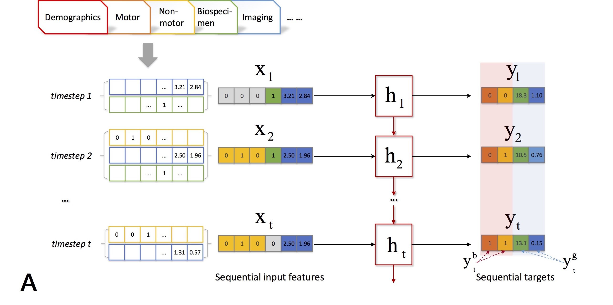

# Nature-Scientific-Reports

This is the completed version of codes for paper [Data-Driven Subtyping of Parkinson’s Disease Using Longitudinal Clinical Records: A Cohort Study](https://www.nature.com/articles/s41598-018-37545-z.pdf) by [Xi Sheryl Zhang](https://www.xi-zhang.net/), Jingyuan Chou, Jian Liang, Cao Xiao, [Yize Zhao](http://vivo.med.cornell.edu/display/cwid-yiz2013), [Harini Sarva](https://weillcornell.org/harini-sarva-md), [Claire Henchcliffe](https://weillcornell.org/chenchcliffe), and [Fei Wang](https://sites.google.com/site/feiwang03/).

## Overview
There are three parts of the implementation, including data preparation, subtyping and Statistical analysis. Basically, we preprocess the PPMI data and subtype patients via Matlab. Then, based on the subtyping results, the statistical analysis is conducted by Python.

## Data Preparation

<p align="center"></p>
The preprocessed data used in this work and [Time-aware LSTM](https://github.com/illidanlab/T-LSTM) can be find in the folder Subtyping Procedure/data_PPMI.mat. It is an entirely deidentified file (with fake patient index), based on the data published on June 21, 2016. The variable X and Y are the input and target feature matrix respectively, where each row is merged at one specific timepoint. Their dimension are 319 and 82.    

## Subtyping
<p align="center"></p>

## Statistical Analysis
Please find the Python codes in the [Repo](https://github.com/sheryl-ai/PPMI-Subtype-Analysis.git) of Subtype Analysis.

## References
```
@article{zhang2019data,
title={Data-Driven Subtyping of Parkinson’s Disease Using Longitudinal Clinical Records: A Cohort Study},
author={Zhang, Xi and Chou, Jingyuan and Liang, Jian and Xiao, Cao and Zhao, Yize and Sarva, Harini and Henchcliffe, Claire and Wang, Fei},
journal={Scientific reports},
volume={9},
number={1},
pages={797},
year={2019},
publisher={Nature Publishing Group}
}
```
This paper can be accessed on : [Data-Driven Subtyping of Parkinson's Disease Using Longitudinal Clinical Records: A Cohort Study](https://www.nature.com/articles/s41598-018-37545-z.pdf). Supplementary Material can be found [here](https://static-content.springer.com/esm/art%3A10.1038%2Fs41598-018-37545-z/MediaObjects/41598_2018_37545_MOESM1_ESM.pdf).


## Contact
Please email to [sheryl.zhangxi@gmail.com](mailto:sheryl.zhangxi@gmail.com) should you have any questions, comments or suggestions.
